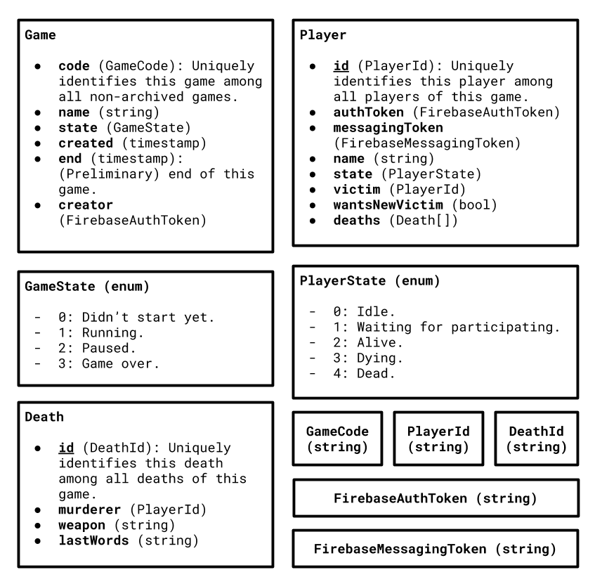

# Murderers

A simple real-world game for getting to know each other.
Especially useful for larger groups.

## How it works: The basics

First, a **user** *creates* a game.
He will be the **creator**, the only user allowed to do administrative operations.
He receives a **game code** that uniquely identifies the game.

By sharing this code with other users, he can allow them to *join*.
Users who joined a game are called **players**.
Once enough players joined, the creator can **start** the game.

Every player has a **victim**, another player which he has to kill.
**Killing** refers to giving them an object in the physical world and then logging the event in the app.
The victim will then receive an alert that it has been killed, which it can either confirm or appeal.
The victim *dies* by confirming.
If the victim *appeals* this event, the **creator** gets notified.

Each game runs for a set amount of time.
Once the game is over, all players get notified and a summarizing statistics screen gets shown to everyone.
The **winner** is whoever killed the most people.

## Extended functionality

This is functionality that is impossible or difficult to implement when playing the game with paper snippets instead of the app.

### Joining mid-game

If players join mid-game, they are added to a set of players who want to play.
Each time an active player dies, all of these players get added between the murderer and the victim's victim.

### Leaving mid-game

If players leave a game, it's just like they die, except they can join again later on.

### Complaining

If players know that their victims know they are their murderer, the game is not much fun anymore.
That's why they can complain.
Once enough people complained, the creator can shuffle all the players or only the players who complained.

### Shuffling players

The creator can shuffle players, causing all victims to be selected randomly.

### Resurrecting players

The creator can resurrect players, joining them to the set of players who want to play.

### Zombie mode

If players die, they just get a time-off.

## Interesting aspects of the game (from a programmer's point of view)

It's a fun, social game.

It's highly asynchronous (many independent actors).

It's all about information management.

## Architecture


The back-end is located in the `backend` folder, the front-end Flutter app in the `lib` folder.

### Why Firebase is used

The Firebase services are easy to use and easy to scale.

### Why Flutter is used

It's a convenient tool for creating apps quickly and for multiple platforms.

## Data model



## Lifetimes

Both the players and games are implemented as state machines.

### Player

* **waiting**: The player waits for a victim.
  * *shuffling*, *starting game*, *death of someone*: to alive
* **alive**: The player is playing and alive.
  * *murderer presses kill button*: to dying
* **dying**: The player's murderer insists he/she killed the player.
  * *player confirms death*: to dead
  * *player appeals death*: to alive
* **dead**: The player got killed.

### Game

* **not started yet**: The game got created but didn't start yet.
  * *start*: to running
  * *delete*: delete
* **running**: The game is running.
  * *pause*: to paused
  * *end* (time ran out): to over
* **paused**: The game got paused.
  * *continue*: to running
  * *end*: to over
* **over**: The game is over.
  * *delete*: delete

## The back-end

The back-end uses Firestore as the database system.

### Firestore

The data model equals the one described above, with the exception of user ids and game codes.
Those aren't explicitly saved, because they are represented by Firestore's document id.

The collection `games` holds all the games as documents.
The games' codes equal the documents' ids.
Each game holds information about the game itself, just like described in the data model.

Also, each game has a sub-collection of `players`.
The players' ids equal the corresponding documents' ids.
Each player holds information about him/herself, just like described in the data model.

### Firebase Auth

Firebase Auth is used to authenticate users.
If users don't sign in, they connect using an anonymous account.

### Firebase Cloud Messaging

FCM is used for delivering notifications.
There are several topics:

* Each game has a topic named `game_<game code>`.
* There's a `deaths` topic for deaths.

### Cloud Functions

#### `create_user`

Creates a new user by saving the auth token, the messaging token and the name.
TODO: Validate auth token.

```url
create_user?authToken=...&messagingToken=...&name=Marcel
> { id: 'abcd' }
```

#### `create_game`

Creates a new game with the provided parameters.
The user who calls this method becomes the creator.

```url
create_game?user=...&authToken=...&name=TheGameName&start=12345678&end=123456789
> { code: 'abcd' }
```

#### `join_game`

Joins the user to an existing game.

```url
join_game?user=...&authToken=...&code=abcd
> { id: 'a1b2c3d4e5' }
```

#### `get_game`

TODO: implement properly

```url
get_game?code=abcd
> {  }
```

#### `start_game`

Starts an existing game.
Only the creator can successfully call this webhook.

```url
start_game?authToken=...&code=abcd
> Game started.
```

#### `kill_player`

Kills the caller's victim.
Only useful if the caller has a victim.

```url
kill_player?user=...&authToken=...&code=abcd&id=a0
> Kill request sent to victim.
```

#### `die`

The caller confirms the own death.

```url
die?user=...&authToken=...&code=abcd
> You died.
```

#### `impeach_death`

#### `kick_player`

#### `complain_about_being_outsmarted`

#### `shuffle_victims`

Shuffle's the players victims.
TODO: implement properly

```url
shuffle_victims?authToken=...&code=...&onlyOutsmartedPlayers=true
> Players shuffled.
```

#### `resurrect_players`

#### `set_end`
