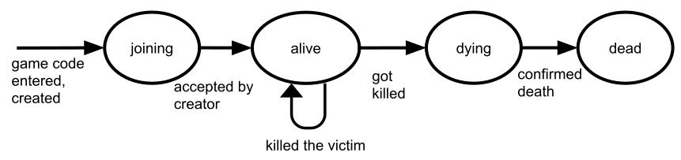

# Data model

These are the main entities involved in the game:

* **users**: An actual user of the service.
* **games**: A round or session of playing Murderers.
* **players**: Users which participate in a game.

Now, let's look at all of them in more detail.

## User

A user represents an actual user of the service.
It stores the state which is bound to the user, i.e. Firebase Auth tokens and Firebase Cloud Messaging tokens as well as the name of the user.
Each user has a unique id.

## Game

A round or session of playing the game.
The game can be seen as a state machine which operates like this:

Also, every game has a unique code among all games as well as basic information about the game, such as

* the **name** of the game,
* the id of the **creator** and
* the timestamp of when the game **ends**.

## Player

A user participating in a game.
Because users cannot participate as multiple players in the same game, the players just use the user ids to reference each other.

A player can be seen as a state machine which operates like this:

Furthermore, each player can hold some additional, game-related information, such as

* the number of **kills**,
* the current **murderer** (if there is one),
* the current **victim** (if there is one),
* whether the player **wants a new victim**,
* information about the death (if the player is dead), including
  * **last words**,
  * the **murderer**,
  * the **time of death** and
  * the **murder weapon**.

A few things to notice about when these attributes are set (aka how the state relates to the attributes):

* If the state is **"joining"**, the kills are 0. There is no murderer, victim nor death and the player is not outsmarted.
* If the state is **"alive"**, there is no current murderer nor death.
* If the state is **"dying"**, there is a murderer but no death (yet).
* If the state is **"dead"**, there is no victim anymore and the player doesn't want a new victim. A murderer and a death do exist.

## Further references

* See ["Firestore"](firestore.md) for information about how the data model is actually stored.
* See ["Murderous graph"](murderous_graph.md) for information about how the data change over time.
