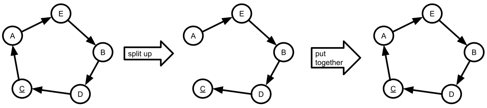
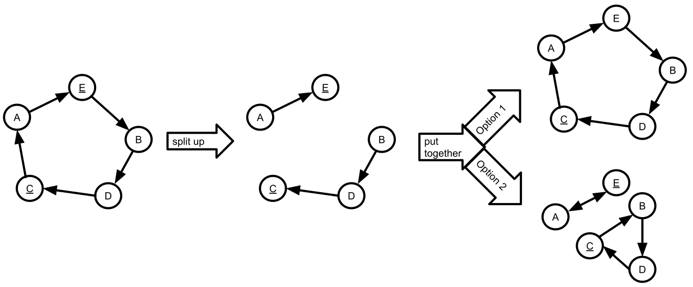
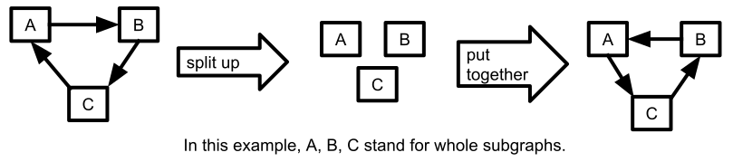

# A murderous graph

A main concern of the game is to keep track of who has to kill whom.
Mathematically, we can construct a murderous graph $G = (P, K)$, where $P$ is the set of players and the mapping $K \subseteq P \times P$ is defined as $(a,b) \in K \leftrightarrow a \text{'s victim is } b$.

This document describes how the in-game operations (starting a game, killing players etc.) work.

## Starting a game

The moment the game starts, the task is to connect all the many unconnected nodes.
We could just connect them randomly and make sure that no node points to itself.

However, according to experience the game is less fun if there are multiple cycles. For example, if A's victim is B and B's victim is A, after one of them killed the other they can no longer participate in the game.

To counter this issue, the only way is to connect all of the players to one big cycle.
The order of the players is selected randomly.

**Insight: The graph should always be one big cycle.**

## Shuffling players who want a new victim

Some players may be clumsy and make it obvious to their victims that they are their murderer.
That's why they can request a new victim.

To give them new victims, we'll first have to split the graph into multiple graphs by deleting every connection after the players who requested new victims.
Then, our task is to put the graph back together.

### One player wants a new victim

If only one player requests a new victim, there's not much we can do.
If we split up the graph, there's only one option to put it back together:
The graph we started with.

### Two players want new victims

If two players request a new victim, there's also not much we can do.
If we split up the graph, we only got two options to put it back together:

* The graph we started it.
* A graph with two cycles, which we don't want for the reasons above.

### Three or more players want new victims

Finally!
This is where things get interesting.
After splitting up the graph, we can reverse the order in which the sub-graphs are connected, thereby making sure that every murderer who wanted a new victim gets one.

Obviously, this also works with more than three players.

## Joining a running game

If players join into a running game, they need to be inserted into the graph.

If there's someone who wants a new victim, we can simply insert the new player between that someone and its victim.

If there's no one who wants a new victim, we'll have to wait until the next murder occurs and then insert the new player between the murderer and its next victim.

## Killing a player

If a player gets killed, the victim's victim becomes the new target of the murderer.

If some players are waiting for a victim, they are randomly inserted between the murderer and the victim's victim.

If there are two players who want another victim, the murderer get the victim described like above but is then treated as if he wanted a new victim.
That makes it possible to apply the rule described above in "Three or more players want new victims".
