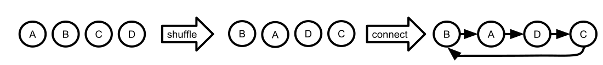

# A murderous graph

A main concern of the game is to keep track of who has to kill whom.
Mathematically, we can construct a murderous graph $G = (P, K)$, where $P$ is the set of players and the mapping $K \subseteq P \times P$ is defined as $(a,b) \in K \leftrightarrow a \text{'s victim is } b$.

This document describes how the in-game operations (starting a game, killing players etc.) work.

## Starting a game

The moment the game starts, the task is to connect all the many unconnected nodes.
We could just connect them randomly and make sure that no node points to itself.

However, according to experience the game is less fun if there are multiple cycles. For example, if A's victim is B and B's victim is A, after one of them killed the other they can no longer participate in the game.

To counter this issue, the only way is to connect all of the players to one big cycle.
The order of the players is selected randomly.

**Insight: The players graph should always be one big cycle.**

## Shuffling players who want a new victim

Some players may be clumsy and make it obvious to their victims that they are their murderer.
That's why they can request a new victim.

### One player wants a new victim

If only one player requests a new victim, there's not much we can do.
If we split up the graph and then melt it back together, the result is the same graph we started with.

### Two players want new victims

### Three players want new victims

## Joining a running game

If players join into a running game, they need to be inserted into the cycle.

## Killing a player

